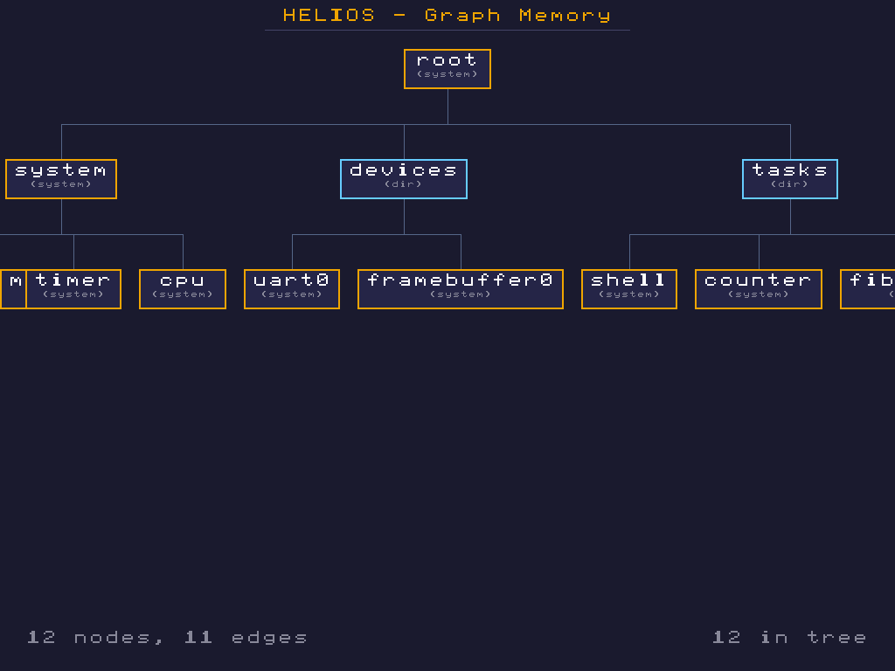
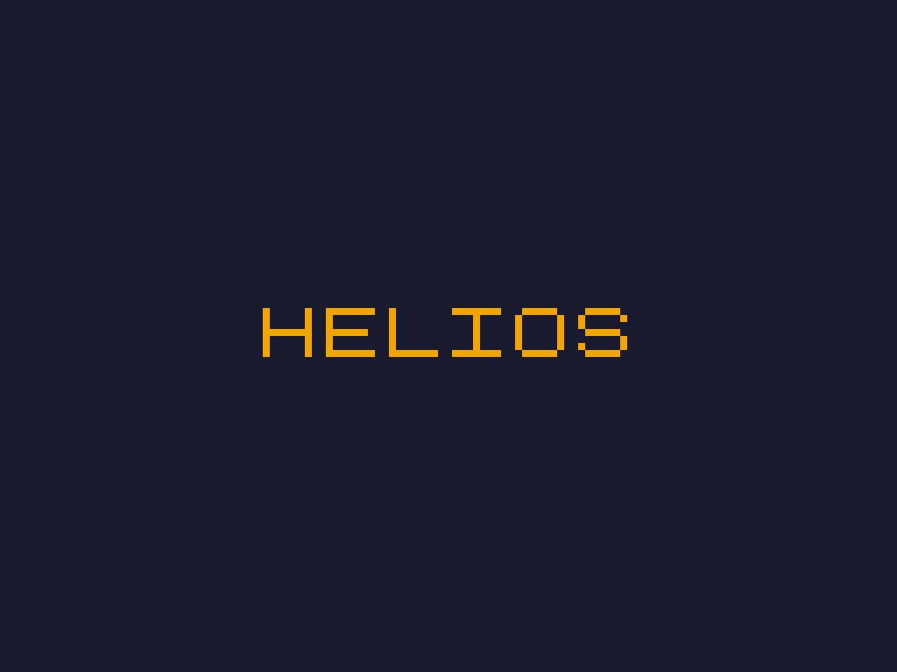
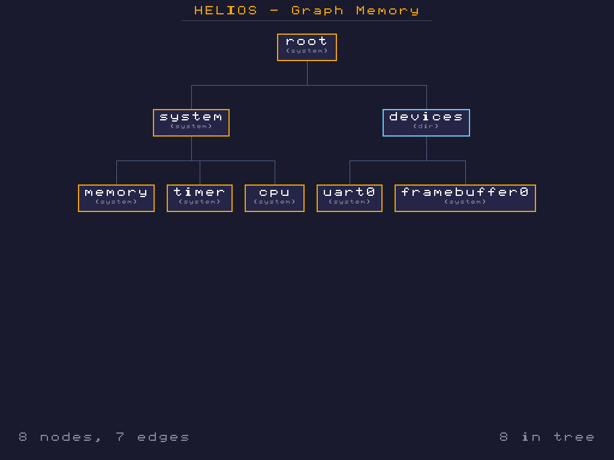
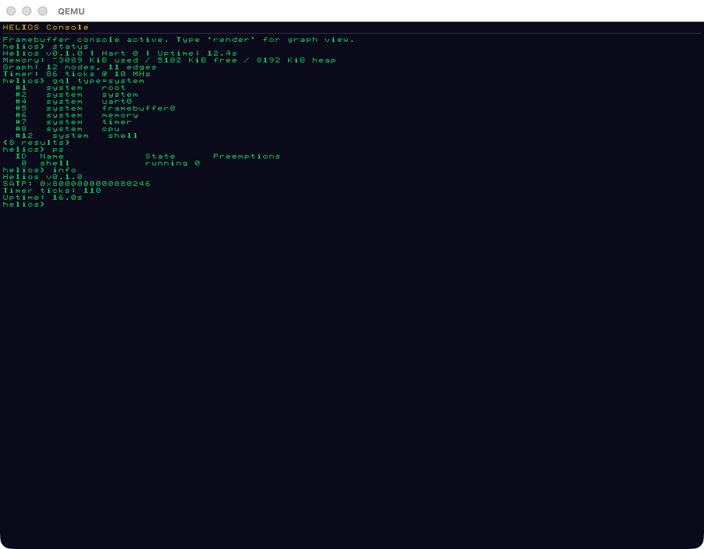
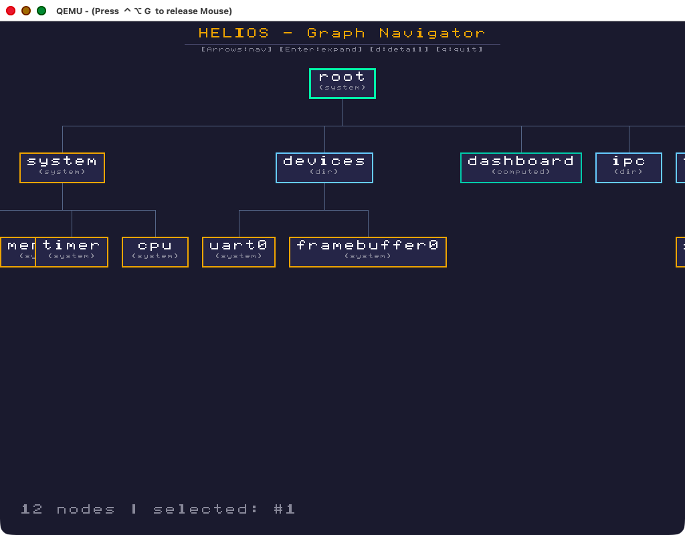
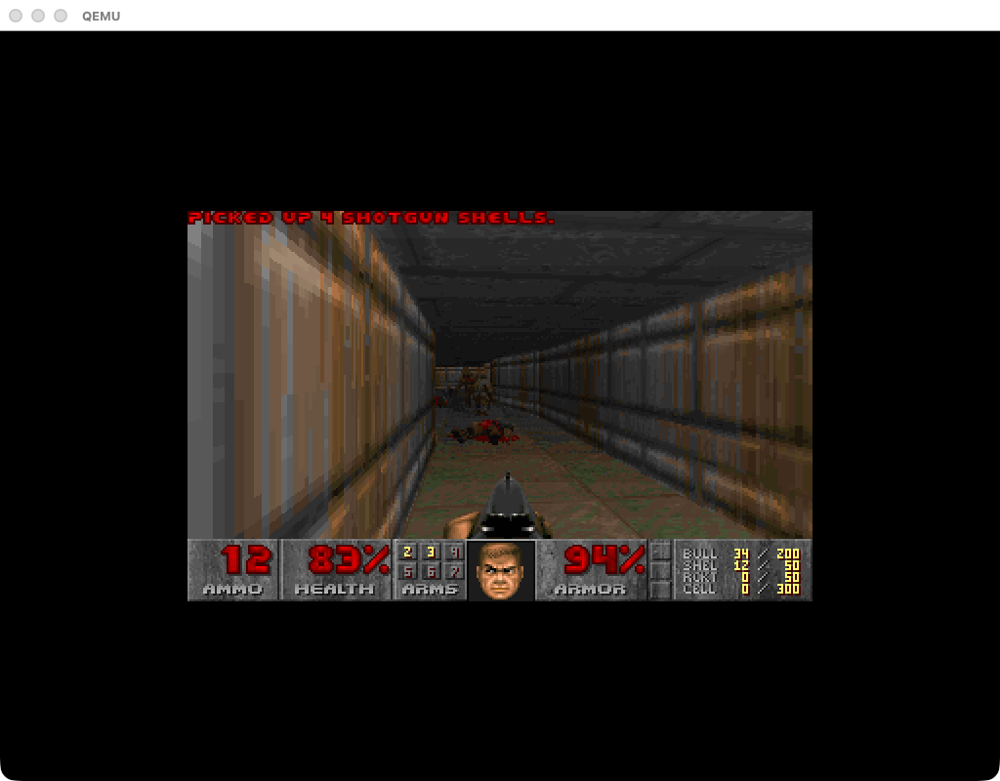

# Helios

an operating system where everything is a memory.

Helios is not a Unix clone. its fundamental abstraction is a persistent, typed knowledge graph rather than a filesystem tree. nodes have IDs, types, content, and named edges to other nodes. devices are nodes. processes are nodes. IPC channels are nodes. the system itself is the graph.

written in Rust, targeting RISC-V 64-bit, running on QEMU.



## documentation

see [`docs/`](docs/) for design rationale and architecture notes:

- [philosophy](docs/design/philosophy.md) — "everything is a memory" thesis
- [capability edges](docs/design/capability-edges.md) — graph-native security model (M29+)
- [userspace tiers](docs/design/userspace-tiers.md) — kernel / native / ported, and the POSIX tension
- [porting software](docs/userspace/porting.md) — bringing non-helios programs in
- [rust on helios](docs/userspace/rust-std.md) — std, targets, and the ecosystem path

## what it has

- **RISC-V 64-bit** bare-metal kernel with OpenSBI
- **Sv39 virtual memory** with identity-mapped page tables
- **graphical framebuffer** via ramfb (1024x768 XRGB8888)
- **framebuffer text console** — retro green-on-black terminal with dual UART/display output
- **trap handling** with timer interrupts (Sstc extension)
- **preemptive multitasking** — timer-driven context switching, plus cooperative yield
- **interactive shell** over UART with 30+ commands
- **graph memory store** — nodes with types, content blobs, and labeled edges
- **graph query language** — filter, traverse, path-find, and pipe queries
- **interactive graph navigator** — keyboard-driven visual graph exploration on framebuffer
- **graph-based IPC** — tasks communicate through channel nodes in the graph
- **live system nodes** — `cat` a device node to see its current state
- **visual graph rendering** — tree layout on the framebuffer with typed node colors and edge routing
- **reactive computed nodes** — formulas that evaluate against the graph at read time
- **persistent storage** — graph serialized to virtio-blk disk, auto-loaded on boot
- **proper memory management** — linked-list allocator with coalescing
- **DOOM** — yes, it runs Doom (cross-compiled C engine, embedded shareware WAD, 2× scaled rendering)
- **TCP/IP stack + HTTP server** — graph is queryable as JSON over the network (M24–M28)
- **U-mode user tasks with capability-edge security** — graph edges *are* the capability space, MMU-enforced (M29–M30)
- **helios-std** — Rust-native userspace library with raw syscall wrappers, typed graph primitives, `println!`, and a bump allocator; first native Rust binary runs as `spawn hello` (M31)
- **graph-native Rust tools** — `spawn ls <id>` walks a node's outgoing edges, `spawn cat <id>` reads a node's content. Built on helios-std; each a few dozen lines of `match` over `Result<_, Errno>`. (M32)
- **dynamic memory via `SYS_MAP_NODE`** — a U-mode task can request fresh zeroed writable memory at runtime. The kernel mints a `Memory` node, maps backing frames into the task's VA window, and grants a `write` edge from caller → new node. `spawn mmap` allocates 32 KiB + 8 KiB and verifies disjoint usable regions. (M33)
- **full edge labels via `SYS_READ_EDGE_LABEL`** — `SYS_LIST_EDGES` returns a compact cap-kind byte per edge; structural labels like `child` / `parent` show up as `unknown`. A follow-up syscall (same `traverse` cap) copies the full UTF-8 label into a user buffer. `spawn ls 1` now prints `child` for all 19 root outgoing edges instead of `?`. (M34)

## building

requires: Rust nightly, QEMU with RISC-V support, RISC-V cross-compiler (for the DOOM C code)

```bash
# install dependencies (macOS)
brew install qemu riscv64-elf-gcc
rustup target add riscv64gc-unknown-none-elf
rustup component add rust-src llvm-tools

# clone (include submodules for doomgeneric)
git clone --recursive git@github.com:solwakes/helios.git
# or, if already cloned:
git submodule update --init

# build
make build

# run (UART only)
make run

# run with framebuffer
make run-gui

# exit QEMU: Ctrl-A X
```

## shell commands

```
helios> help
System:     help, info, status, timer, mem, poke, clear, reboot, panic, fault
Graph:      graph, nodes, node, mknode, edge, set, cat, walk, find, rm, render
Query:      gql <query>
Tasks:      ps, spawn, kill
IPC:        ipc, peek
Storage:    save, load, disk
Display:    tty, nav, render
```

### exploring the graph

```
helios> walk 1
Node #1 "root" (system)
  --child--> #2 "system" (system)
  --child--> #3 "devices" (dir)
  --child--> #10 "tasks" (dir)

helios> gql type=system
  #1   system   root
  #2   system   system
  #6   system   memory
  #7   system   timer
  #8   system   cpu
(5 results)

helios> gql path 1 7
  #1 root --child--> #2 system --child--> #7 timer
  (path length: 2)

helios> gql type=system | edges>2
  #1   system   root
  #2   system   system
(2 results)
```

### running tasks

```
helios> spawn counter
Spawned task #1 "counter"

helios> spawn pingpong
[pingpong] Created channel #13
[pingpong] Spawned ping (task #2) and pong (task #3)
[ping] Sent: ping #1
[pong] Got: ping #1 -> Replying: pong #1
[ping] Got: pong #1
...

helios> ps
  ID  Name             State      Preemptions
   0  shell            running 5
   1  counter          done 0
   2  ping             done 0
   3  pong             done 0

helios> gql type=channel
  #13   channel   pingpong-ch
(1 result)
```

### framebuffer modes

```
helios> tty       # switch to text console on framebuffer
helios> render    # switch back to graph tree visualization
helios> nav       # interactive graph navigator (arrow keys, enter, d for details)
```

### scripting

```
helios> mknode text startup
Created node #14 "startup" (text)

helios> edit 14
Editing node #14 "startup". Enter lines, empty line to finish.
| # boot check script
| status
| gql type=system
| ps
| 
Node #14 updated (38 bytes)

helios> run 14
> status
Helios v0.1.0 | Hart 0 | Uptime: 45.2s
...
> gql type=system
  #1   system   root
  ...
> ps
  ...
Script #14: 3 commands executed
```

## screenshots

**boot splash (M2)**



**graph tree visualization (M12)**



**framebuffer console (M18)**



**interactive graph navigator with keyboard input (M15+M19)**



**DOOM running on Helios (M21)**



## architecture

```
src/
  main.rs              kernel entry point
  uart.rs              NS16550A UART driver
  trap.rs              trap handling + timer interrupts + preemptive scheduling
  shell.rs             interactive command shell (30+ commands)
  console.rs           framebuffer text console (dual output)
  alloc_impl.rs        linked-list heap allocator
  framebuffer.rs       pixel rendering + bitmap font
  fwcfg.rs             QEMU fw_cfg driver
  ramfb.rs             ramfb framebuffer driver
  ipc.rs               graph-based inter-process communication
  arch/riscv64/        boot assembly, linker script, CSR helpers
  mm/                  Sv39 page tables
  graph/               graph memory store, persistence, rendering
    mod.rs             graph data structures (Node, Edge, Graph)
    render.rs          tree visualization + navigator rendering
    navigator.rs       interactive graph navigator
    query.rs           graph query language (GQL)
    compute.rs         reactive computed node evaluation
    persist.rs         graph serialization/deserialization
    live.rs            live system node refresh
    init.rs            graph bootstrap
  task/                preemptive + cooperative multitasking
  doom.rs              DOOM platform layer (DG_* functions, key mapping, framebuffer blit)
  memfuncs.rs          volatile mem* implementations (prevents LLVM recursion)
  virtio/              VirtIO MMIO transport, block device, keyboard input
doom/
  helios_libc.c        bare-metal libc (malloc, printf, memfs file I/O)
  include/             freestanding C headers
```

## the idea

traditional OSes organize data as files in a tree. Helios organizes data as nodes in a graph. the difference:

- a file lives at a path. a node lives at an ID with named edges.
- a directory contains files. a node has edges — `child`, `depends-on`, `version-of`, whatever you want.
- device files are a hack. device nodes are first-class — `cat` the uart0 node and you get live register state.
- processes are separate from files. in Helios, tasks are graph nodes alongside everything else.
- IPC is separate from the filesystem. in Helios, tasks communicate through channel nodes in the same graph.
- you can query the system: `gql type=system | edges>2` finds well-connected system nodes. `gql path 1 7` finds routes through the graph.

the graph is the filesystem, the process table, the device tree, and the IPC mechanism — unified.

## milestones

| # | what | commit |
|---|------|--------|
| M1 | RISC-V boot + UART | `ca3d9ae` |
| M2 | ramfb framebuffer | `0e9c915` |
| M3 | Sv39 page tables | `e5d72a4` |
| M4 | trap handling + timer | `a3f2450` |
| M5 | interactive shell | `ad1213a` |
| M6 | graph memory store | `f72aa1e` |
| M7 | graph visualization (cards) | `a9aa4d2` |
| M8 | live system nodes | `69e2703` |
| M9 | linked-list allocator | `46b6def` |
| M10 | virtio-blk persistence | `df1e3cc` |
| M11 | cooperative multitasking | `0af857d` |
| M12 | tree graph visualization | `c4d4bd2` |
| M13 | reactive computed nodes | `629b599` |
| M14 | preemptive multitasking | `e149d7e` |
| M15 | interactive graph navigator | `7b8f543` |
| M16 | graph query language | `3eab242` |
| M17 | graph-based IPC | `d8d86c0` |
| M18 | framebuffer text console | `60ec256` |
| M19 | VirtIO keyboard input | `30383d2` |
| M20 | shell scripting | `f68c37f` |
| M21 | DOOM | `9849084` |
| M22 | framebuffer u64 optimization | — |
| M23 | window manager | `a5c2987` |
| M24 | virtio-net + ARP + ICMP (ping works) | `c60aff5` |
| M25 | TCP/IP stack + socket API | `44a3147` |
| M26 | HTTP server (graph as JSON) | `1a97184` |
| M27 | write endpoints (graph mutable over HTTP) | `4f96f74` |
| M28 | HTML dashboard | `08ef974` |
| M29 | user space with capability-edge security (MMU-enforced) | `1b39c24` |
| M30 | expanded syscall ABI (write, list_edges, follow_edge, self) | `10fcf5e` |
| M31 | helios-std — Rust-native userspace library + hello user program | — |
| M32 | graph-native Rust tools — `spawn ls <id>`, `spawn cat <id>` | — |
| M33 | `SYS_MAP_NODE` — dynamic user memory via graph-native syscall (`spawn mmap`) | — |
| M34 | `SYS_READ_EDGE_LABEL` — structural edge labels in user-space (`spawn ls 1` shows `child` not `?`) | — |

## license

this is an experiment, not a product. do what you want with it.
